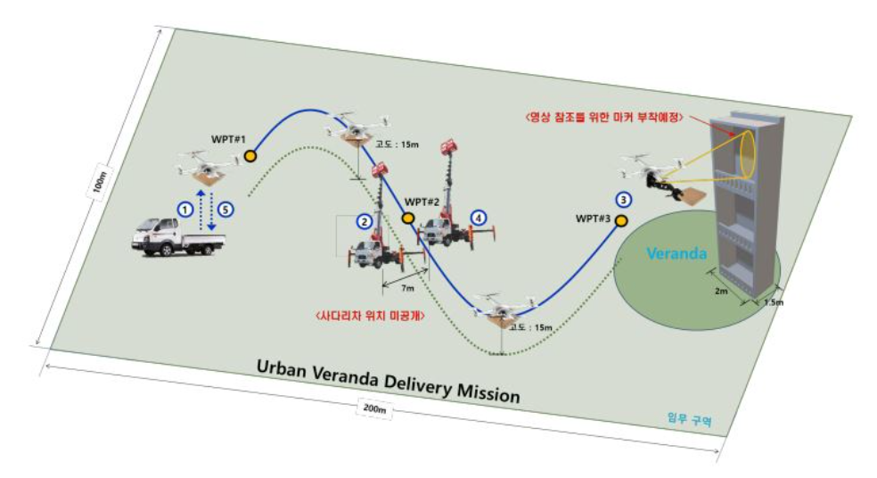
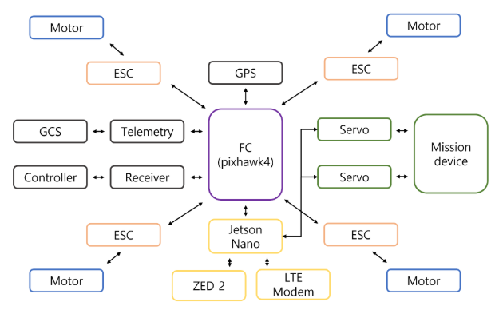
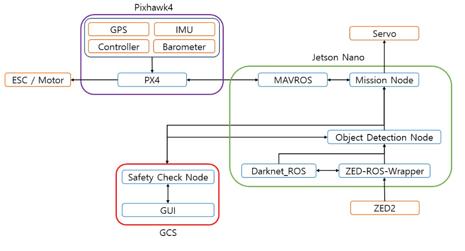
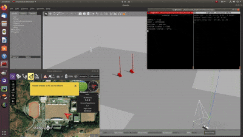

# 자율주행 피자 배달 드론

* 도심 내 작업 중인 사다리차를 회피하고, 아파트 베란다에 택배(피자)를 배달하기 위하 드론 개발 프로젝트입니다.
* 제20회 로봇항공기 대회 자율주행 드론 부문 참가

## 임무 개요
1. 트럭 화물칸에서 드론이 이륙 후 WPT#1까지 이동
2. WPT#2로 이동하며, 이동 간 임의로 배치된 사다리차를 인식 및 회피
3. 아파트 3층을 인식하여 배란다 진입
4. 3층 베란다 진입 후 택배(피자) 투하
5. WPT#2 복귀 후 사다리차 재인식 및 회피
6. WPT#1 도달 후 트럭 화물칸에 착륙

    

## 팀 구성
<b> TEAM. sAIM</b>

| 이름 | 담당 업무 |
|-|-|
|박진우| 팀장
|금강산 | 기구 설계 |
|정민기 | 기구 설계 |
|장나경 | 기구 설계 |
|이 수 | 제어SW 개발 |
|박수현 | 제어SW 개발 |
|박원우| 제어SW 개발 |
|이용빈 | AI 개발 |
|이재표 | AI 개발 |
|정유찬 | AI 개발 |
|유지원 | AI 개발 |
|김민솔 | AI 개발 |

## 사용 기술
|개발 환경 | 사용 기술|
|-|-|
| OS | |
| 언어 |   |
| ML/DL |    |
| 로보틱스   어플리케이션 |  |
| 프로젝트 관리도구|  |

## 시스템 아키텍쳐
<b> 드론 HW 레이아웃 
</b>

    

<b> 시스템 아키텍처

    

## 적용 기술
* YOLO 기반 사다리차 인식

    

* Potential Field Method 기반 경로 설정 및 장애물 회피 알고리즘 적용

    

## 통합 기술 시연 영상
* 사람 인식 (사다리차 인식 대체) 후 회피, 이동 경로 재설정

    

